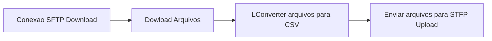

# conversor-xls-csv

 Aplicativo para converter arquivos **XLS** e **XLSX** de um **sftp Dowload** e transferir a um **sftp Upload** em **CSV**

### Módulos usados 

[https://www.npmjs.com/package/ssh2-sftp-client](https://www.npmjs.com/package/ssh2-sftp-client)
[https://www.npmjs.com/package/node-xlsx](https://www.npmjs.com/package/node-xlsx)

## Diagrama de funcionamento

